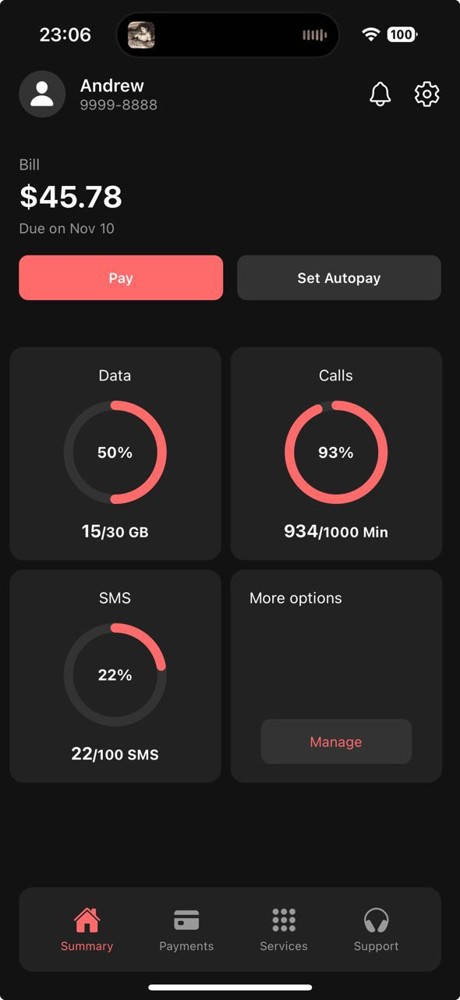
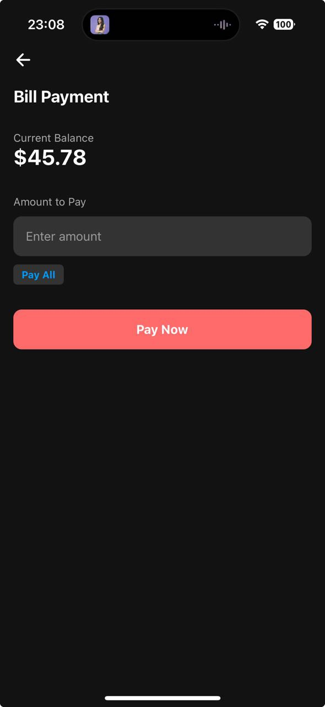
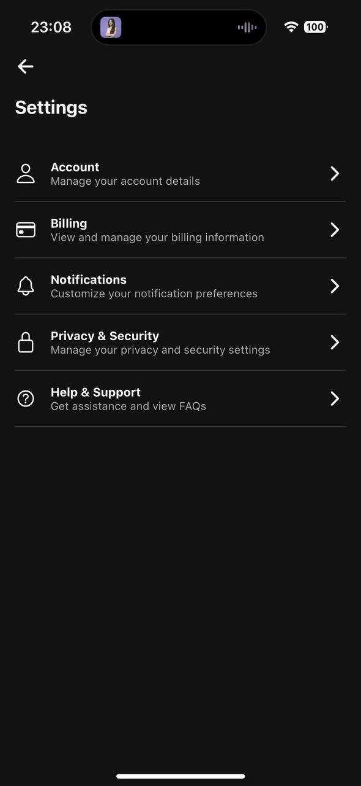
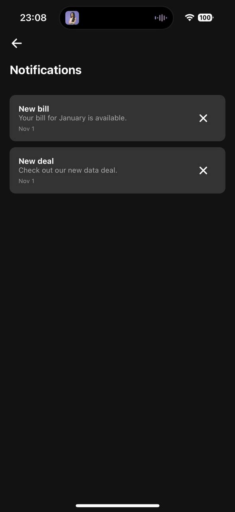

# Telekom [WIP]

This is a mobile app for a mobile operator showing usage and bills.






Inspired from [this design](https://dribbble.com/shots/24196570-Telecom-Mobile-App).

## Get started

1. Install dependencies

   ```bash
   bun install
   ```

2. Start the app

   ```bash
    bun start
   ```